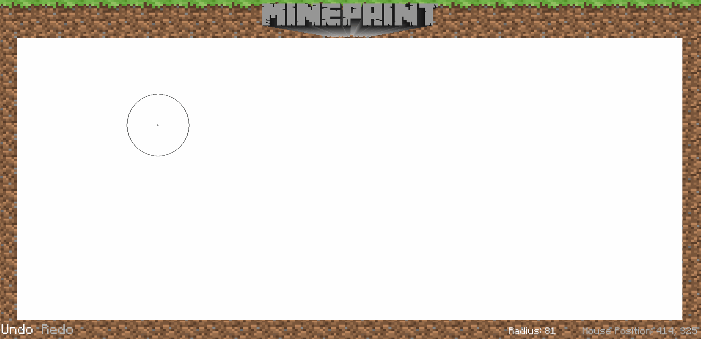

# Paint Project

## What is it?
This program is a clone of MS Paint with a Minecraft theme. I designed and programmed it by myself for a school project in high school. The project required us to make a paint program with a twist: we could design the program with any theme we'd like. So I chose the classic video game Minecraft

## What does it use?
The program is made in Python 3 with the use of the PyGame library for graphics related tasks.

## Shortcuts
- `E`: Opens the "inventory" to access the drawing options
- `ESC`: Opens the "pause menu" to allow the user to save or exit their current session
- `1`: Switch to colour 1
- `2`: Switch to colour 2
- `CTRL + Z`: Undo
- `CTRL + R`: Redo
- `CTRL + S`: Save the current image
- `CTRL + O`: Open an existing image to edit

## Features
This paint program features a bunch of different tools to help the user create their master piece

### Pen Tool
Simple drawing tool that changes thickness
 

### Line Tool
Draws straight line from where you click to where you let go
 

### Oval Tool
Draws a circle or an oval (unfilled/filled) from where you click to where you let go
 

### Rectangle Tool
Draws a rectangle (unfilled/filled) from where you click to where you let go
 

### Spray Can Tool
Colors in an area slowly dot by dot for a "spray can" effect
 

### Stamp Can Tool
Select and "stamp" images of any size onto the canvas
 

### Bucket Tool
Fill in an area that is closed off by another color
 

### Filter Tool
Convert the whole canvas to a filtered version, either inverted colours or sepia
 

### Font Tool
Type any text and choose from selected fonts to draw on the canvas
 
